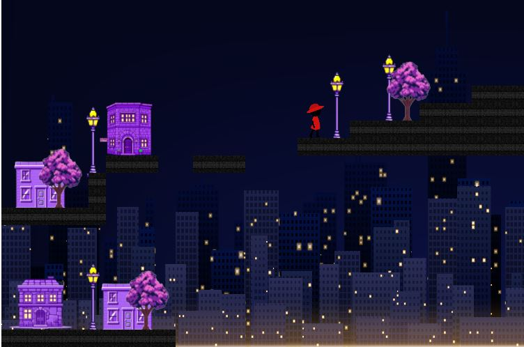
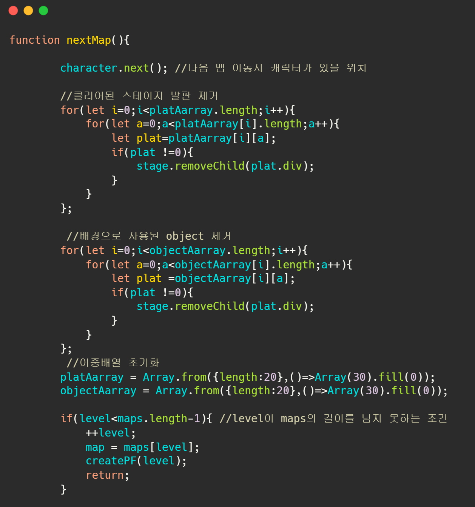

# 🏙️ Going to Sweet Home at Night
 
도시의 높은 건물들 사이로 펼쳐지는 밤거리.  
플레이어는 피곤한 하루를 마치고 집으로 향합니다.  
걷고, 점프하고, 발판을 건너며 집에 무사히 도착하세요!

---

## 🎮 게임 개요
 
- **장르**: 2D 횡스크롤 플랫폼 게임  
- **목표**: 장애물을 피하고 발판을 건너 목적지인 '집'에 도착하는 것  
- **배경**: 높은 건물이 즐비한 도시의 밤거리  

---

## 🛠️ 주요 기능

- **캐릭터 모션**
  - 걷기(Walk) 
  - 점프(Jump) 동작 구현 

- **화면 전환**
  - 배경 끝에 도달 시 다음 구간으로 전환 
  - 최종 목적지 도달 시 '엔딩 화면'으로 전환 

- **사운드**
  - 게임 시작과 동시에 시작하고 엔딩 장면에서는 꺼짐

- **발판 시스템**
  - 맵 내에서 원하는 위차랄 지정하고 게임 시작과 동시해 생성
  - 발판 위에서 캐릭터가 점프가능
  - 다음 맵으로 이동시 기존 발판들은 삭제되고 새로 생성

---
## 개발환경
-**언어**
 
 
 
-**개발도구**
 
-**버전관리**
 
 
## 대표 코드 설명
 
